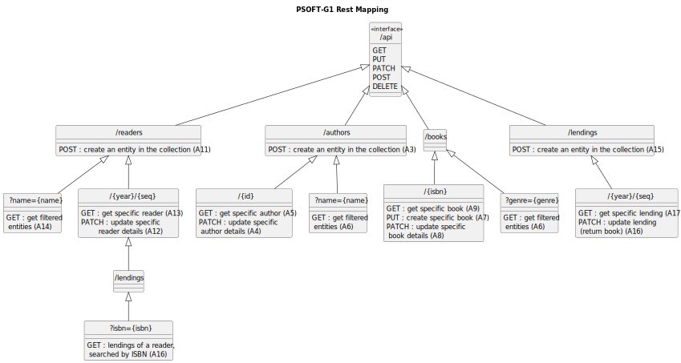

| Method | URI Template                                  | Equivalent RPC operation | Access                  |                                       
|:-------|:----------------------------------------------|--------------------------|-------------------------|
| POST   | api/readers                                   | createReader             | *Anon*                  |
| GET    | api/readers?name={name}                       | getReadersByName         | Librarian               |
| GET    | api/readers/{year}/{seq}                      | getReader                | Librarian, Reader(Self) |
| PATCH  | api/readers/{year}/{seq}                      | updateReader             | Reader(Self)            |
| GET    | api/readers/{year}/{seq}/lendings?isbn={isbn} | getReaderLendingsByIsbn  | Reader(Self)            |
| POST   | api/authors                                   | createAuthor             | Librarian               |
| GET    | api/authors?name={name}                       | searchAuthorsByName      | Librarian, Reader       |
| GET    | api/authors/{id}                              | getAuthor                | Librarian, Reader       |
| PATCH  | api/authors/{id}                              | updateAuthor             | Librarian               |
| GET    | api/books/{isbn}                              | getBook                  | Librarian, Reader       |
| PUT    | api/books/{isbn}                              | createBook               | Librarian               |
| PATCH  | api/books/{isbn}                              | updateBook               | Librarian               |
| GET    | api/books?genre={genre}                       | getBooksByGenre          | Librarian, Reader       |
| POST   | api/lendings                                  | createLending            | Librarian               |
| GET    | api/lendings/{year}/{seq}                     | getLending               | Librarian, Reader(Self) |
| PATCH  | api/lendings/{year}/{seq}                     | updateLending            | Reader(Self)            |                             |

