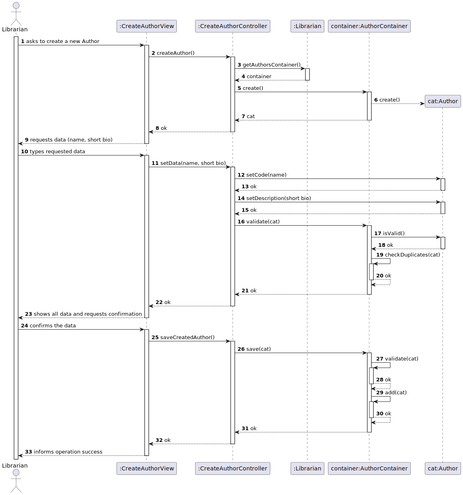

# WP#1A – Authors
## 4. Update Authors
As Librarian I want to update an author’s data.
### 1.2. Customer Specifications and Clarifications

[WP1A-Authors.md](..%2FWP1A-Authors.md)
### 1.3. Acceptance Criteria
- AC

### 1.4. Found out Dependencies
- The Librarian must be authenticated in the system
### 1.5 Input and Output Data
- The librarian needs to give all the details to register the book
  **Input Data:**
* Typed data:
    * Data to be modified

**Output Data:**

* (In)success of the operation

## 3. Design
### 3.1. Sequence Diagram (SD)

### 3.2. Class Diagram (CD)

