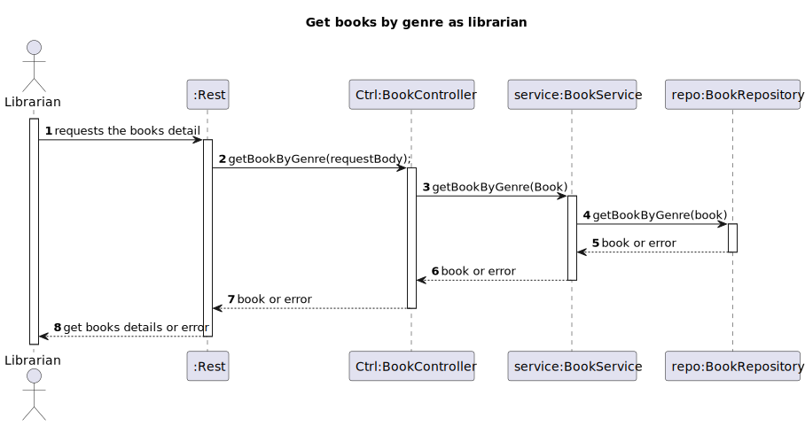

# WP#2A.10 Get a list of Books given a genre
## 1. Requirements Engineering
### 1.1. User Story Description

As Librarian, I want to get a list of Books given a genre.
### 1.2. Customer Specifications and Clarifications

>[Q: Sobre a pergunta 3, creio que ainda não ficou claro se os 'genre's são escolhidos pelo 'librarian' (na hora de registar um livro) de uma lista existente (e eventualmente mutável), ou se são escritos manualmente pelo 'librarian'.](https://moodle.isep.ipp.pt/mod/forum/discuss.php?d=28911#p36699)
>
>A: Quando o Librarian regista um novo livro vai indicar **em que genéro** esse livro se classifica. só poderá indicar um dos géneros previamente registados no sistema

[View WP2A](../Book.md/)

### 1.3. Acceptance Criteria
- AC
-
### 1.4. Found out Dependencies
- The Libarian or Reader must be authenticated in the system
### 1.5 Input and Output Data
- The Librarian or Reader needs to input a genre
**Input Data:**
* Typed data:
    * Genre

**Output Data:**

* (In)success of the operation

## 3. Design
### 3.1. Sequence Diagram (SD)

### 3.2. Class Diagram (CD)

## 4. Tests
## 5. Observations
