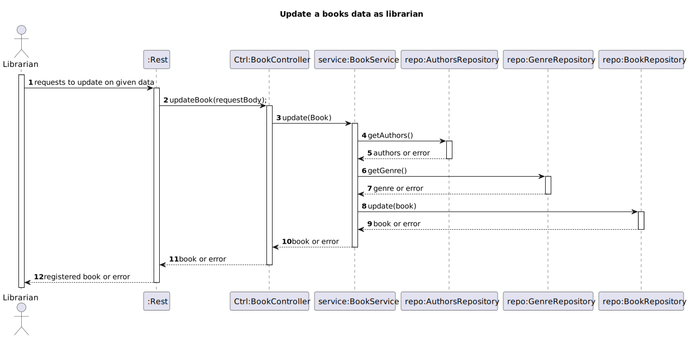

# WP#2A.8 Update Books Data
## 1. Requirements Engineering
### 1.1. User Story Description

As Librarian, I want to update a book (title, genre, description, author(s))
### 1.2. Customer Specifications and Clarifications

[View WP2A](../Book.md/)

### 1.3. Acceptance Criteria
- AC
-
### 1.4. Found out Dependencies
- The Libarian must be authenticated in the system
### 1.5 Input and Output Data
- The librarian needs to give all the details to update the book
  **Input Data:**
* Typed data:
    * Title
    * Desription
    * Author(s)
    * Genre

**Output Data:**

* (In)success of the operation

## 3. Design
### 3.1. Sequence Diagram (SD)

### 3.2. Class Diagram (CD)

## 4. Tests
## 5. Observations
