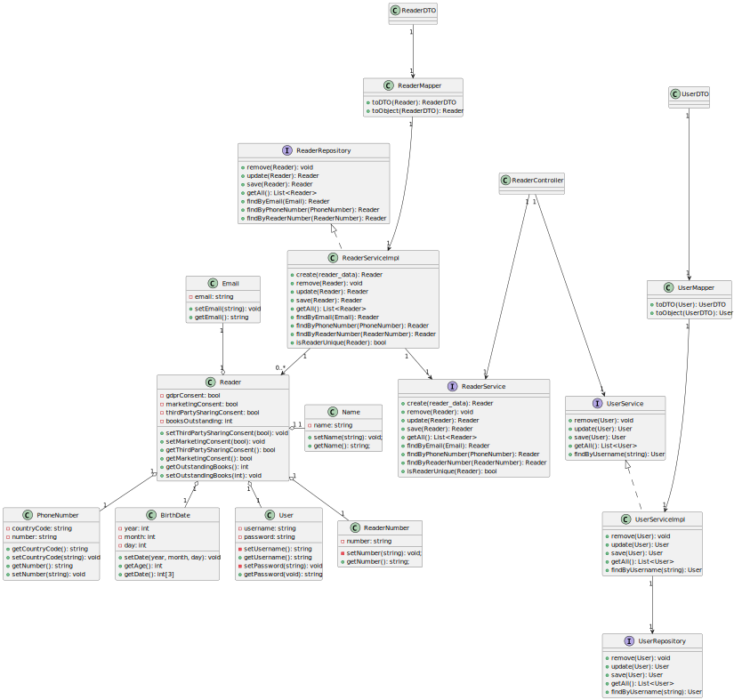

# WP3A Readers
## 1. Requirements Engineering

### 1.1. Customer Specifications and Clarifications

**From the [specifications document:](https://moodle.isep.ipp.pt/pluginfile.php/372607/mod_resource/content/0/PSOFT_LETI_assignment_2023-2024.pdf)**
>Central City library needs a system to manage their library, readers and book lending. The library consists
of thousands of books (no other media formats are available) organized by genre (e.g., Science-fiction,
mistery, Law, Medicine, etc.) that the readers can lend, take home and return after a period (typically 15
days). When a reader doesn’t return a book on time a fine will be applied per day of delay

**From the client clarifications:**

#### What describes someone "anonymous":

> Q: Boa tarde, gostaria são as caracteristicas que descreve uma pessoa anonymous?
>
> A: um utilizador anónimo é um utilizador que desconhecemos e não é importante saber nada nada sobre ele.
para o requisito "11. As anonymous I want to register as a reader" de notar que este anónimo se quer registar como leitor e como tal irá indicar as caracteristicas necessárias e deixar de ser anónimo no fim do registo

#### Name:
> Q: É requisitado apenas o 1º e ultimo nome? 3, 4, 5 nomes?
>
> A: não necessitamos distinguir quantos nomes a pessoa tem

> Q: São permitidos títulos? (Sr., Dr., …)
>
> A: nao há necessidade de capturar esta informação

> Q: Apenas devem ser permitidas letras?
>
> A: qualquer caracter alfanumérico

> Q: Deve ser apenas permitido o alfabeto latino? Devem ser permitido outros alfabetos (cirilico, grego, ...) ou sistemas de escrita (árabe, hebraico, ...)?
>
> A: basta considerar o alfabeto Latino

> Q: Pode ser deixado vazio?
>
> A: nao

> Q: Pode ser deixado vazio?
>
> A: nao

> Q: Existem algumas palavras proibidas?
>
> A: sim. deve existir no sistema uma configuração de "palavras proibidas" que não são aceites no nome do Leitor

#### Email:

> Q: Um utilizador pode ter vários emails?
>
> A: nao

> Q: Um mesmo email pode pertencer a vários utilizadores?
>
> A: nao

> Q: É necessário validar se o email realmente existe?
>
> A: não. basta que esteja no formato correto

> Q: Permite todos os dominios de email? Ou apenas um grupo (gmail.com, hotmail.com, isep.ipp.pt)? Se sim, quais?
>
> A: qualquer dominio

#### Date of Birth:

> Q: Existe uma idade mínima? (ex. nascido em 2024)
>
> A: Leitor deve ter pelo menos 12 anos

> Q: Existe uma idade máxima? (Ex. nascido em 1812)
>
> A: nao

> Q: A idade influencia algo? (Acesso a certas funcionalidades/livros, Recomendação de livros)
>
> A: de momento esse controlo é feito fisicamente pelo bibliotecário e fora do sistema

#### Phone Number:

> Q: Um utilizador pode ter vários números de telefone?
>
> A: nao

> Q: Um mesmo número de telefone pode ser usado em vários leitores?
>
> A: nao

> Q: O número de telefone deve ser português ou admite outros países?
>
> A: basta considerar numeros portugueses de momento

> Q: O número de telefone deve ser móvel ou pode ser fixo?
>
> A: ambos

#### GDPR Consent:
> Q: Um simples sim/não é suficiente ou deve ter algum tipo de assinatura digital?
> 
> A: simples "sim/não"

> Q: Que efeitos existem ao recusar? É permitido ao utilizador criar conta como leitor? Perde algumas funcionalidades?
>
> A: o utilizador tem que aceitar a politica de privacidade de dados. se recusar não se poderá registar no sistema

> Q: Posso recusar apenas parcialmente?
> 
> A: é possivel recusar o consentimento de partilha de informação com terceiros, bem como o consentimento para efeitos de marketing

#### Reader Number:
> Q: Deve ter um tamanho pré-definido (Ex. todos os nºs devem ter 8 caracteres)
>
> A: nao

> Q: Segue alguma regra (ex. certos números para certas bibliotecas/idades/…) ou é apenas auto-incremental?
>
> A: é composto pelo ano de registo e um número sequencial, ex., 2023/1, 2024/19876

#### Updating personal data as Reader:
> Q: Como leitor posso alterar todos os meus dados? Se não, quais?
> 
> A: sim, à exceção do número de leitor

### Data access as a Librarian:
> Q: Como bibliotecário posso ver todos os dados do leitor?
> 
> A: não. a data de nascimento não deve ser visualizada, mas sim a idade do leitor

### 1.2. Found out Dependencies
- None

## 2. Design
### 2.1. Class Diagram (CD)

## 3. Tests
- None
## 4. Observations
- None
