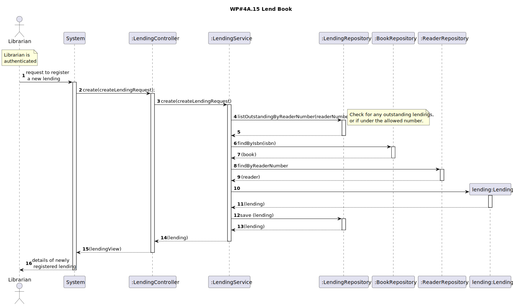

# WP#4A.15 Lend Book
## 1. Requirements Engineering
### 1.1. User Story Description

As Librarian, I want to lend a book to a reader. The lending can only be done if the reader has no
overdue books and the reader can have at most 3 books lent. The return date must be presented
to the Librarian.

### 1.2. Customer Specifications and Clarifications

[View WP4A](../WP4A-Lendings.md/#12-customer-specifications-and-clarifications)

### 1.3. Acceptance Criteria
- AC
- 
### 1.4. Found out Dependencies
### 1.5 Input and Output Data

**Input Data:**

* Typed data:
  * Reader Number
  * ISBN

**Output Data:**

* (In)success of the operation

### 1.6. System Sequence Diagram (SSD)
### 1.7. Functionality
### 1.8 Other Relevant Remarks
## 2. OO Analysis
### 2.1. Relevant Domain Model Excerpt
### 2.2. Other Remarks
## 3. Design
### 3.1. Sequence Diagram (SD)

### 3.2. Class Diagram (CD)
## 4. Tests
## 5. Observations
