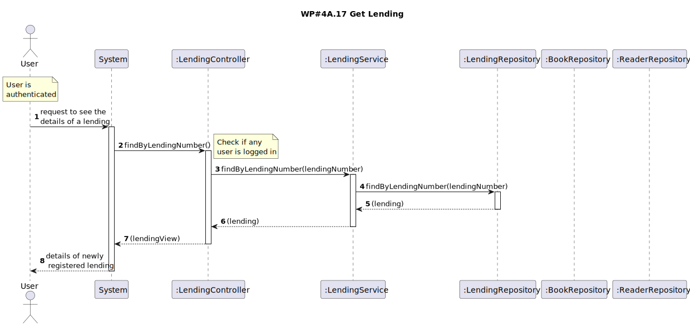

# WP#4A.17 Get Lending
## 1. Requirements Engineering
### 1.1. User Story Description

As Reader or Librarian I want to know the details of a lending given its lending number

### 1.2. Customer Specifications and Clarifications

[View WP4A](../WP4A-Lendings.md/#12-customer-specifications-and-clarifications)

>[Q:Deve ser possível que o leitor e o bibliotecário tenham acesso aos detalhes de um empréstimo através do seu número.
Pode especificar quais são os detalhes que devem ser facultados? Existe alguma diferença nos detalhes a serem facultados, caso seja um leitor ou um bibliotecário a solicitar?
](https://moodle.isep.ipp.pt/mod/forum/discuss.php?d=28894#p36490)
>
>A: a ambos deve ser facultado:
>- lending number
>- book title
>- lending date
>- return date
>- number of days till return date (if applicable)
>- number of days in overdue (if applicable)
>- fine amount (if applicable)

### 1.3. Acceptance Criteria
- The user is shown the introduced lending number, the book title, the lending date, the return date, the number of days until the return date (if applicable), the number of days in overdue (if applicable), and the fine amount (if applicable). 

### 1.4. Found out Dependencies
### 1.5 Input and Output Data

**Input Data:**

* Typed data:
    * Lending Number

**Output Data:**
 * Lending Number
 * Book title
 * Lending date
 * Return date
 * Number of days till return date (if applicable)
 * Number of days in overdue (if applicable)
 * Fine amount (if applicable)

### 1.6. System Sequence Diagram (SSD)
### 1.7. Functionality
### 1.8 Other Relevant Remarks
## 2. OO Analysis
### 2.1. Relevant Domain Model Excerpt
### 2.2. Other Remarks
## 3. Design
### 3.1. Sequence Diagram (SD)

### 3.2. Class Diagram (CD)
## 4. Tests
## 5. Observations
