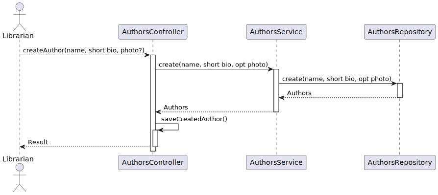

# WP#1A – Authors
## 5. Register Author 
As Librarian I want to register an author (name, short bio).
### 1.2. Customer Specifications and Clarifications

>[View WP1B](..%2FWP1B-Authors.md)

>[Q:   Referente ao que é falado sobre a foto, o mesmo se aplica ao Wp do author/reader?
](https://moodle.isep.ipp.pt/mod/forum/discuss.php?d=29861)
>
>A: Sim

### 1.3. Acceptance Criteria
- Os mesmos critérios do caso de uso do WP1 contemplando agora a possibilidade de adicionar uma imagem.

### 1.4. Found out Dependencies
- The Librarian must be authenticated in the system
### 1.5 Input and Output Data
- The librarian needs to give all the details to register the book
  **Input Data:**
* Typed data:
    * Name
    * Description
    * Photo (not written but uploaded)

**Output Data:**

* (In)success of the operation

## 2. Design
### 2.1. Sequence Diagram (SD)

### 2.2. Class Diagram (CD)

