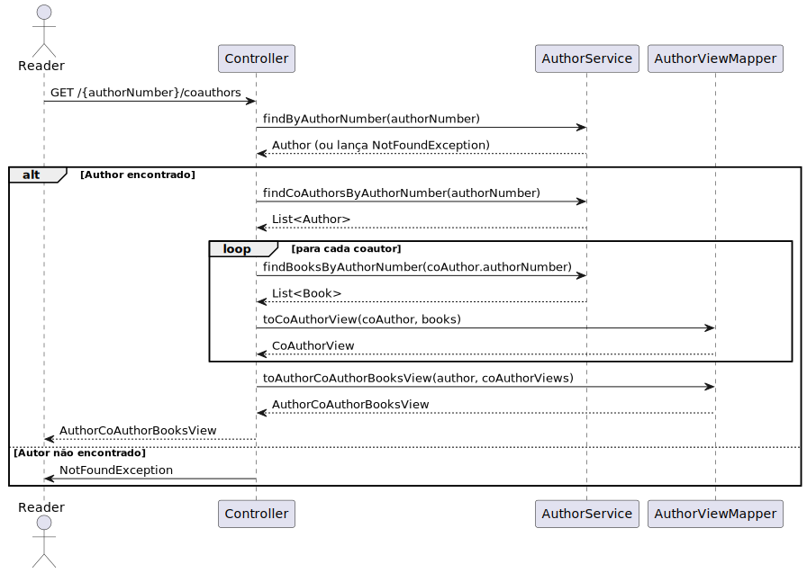
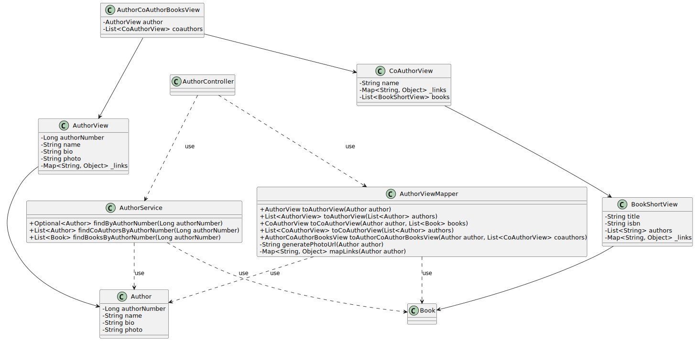

# WP #1B - Authors - Know the co-authors of an author and their respective books

## 1. Requirements Engineering
### 1.1. User Story Description
As Reader I want to know the co-authors of an author and their respective books

### 1.2. Customer Specifications and Clarifications

>[View WP1B](..%2FWP1B-Authors.md)

>[Q: Como irá ser feita a pesquisa? Pelo nome do autor? Pelo authors number?  ](https://moodle.isep.ipp.pt/mod/forum/discuss.php?d=29862)
>
>A: Através de recursos rest e em subrecursos, não em “pesquisas”

>[Q: Os co-authors devem ser guardados nos livros? 
Se sim, quando o livro é criado para além dos atributos 
da WP anterior temos de criar o livro com mais este atributo? ](https://moodle.isep.ipp.pt/mod/forum/discuss.php?d=30023)
>
>A: O requisito "7. As Librarian, I want to register a book (isbn, 
title, genre, description, author(s))" do WP 1 já devia 
ter permitido o registo de livros com vários autores. 
não se trata de um novo atributo "coautor"

### 1.3. Acceptance Criteria
- Deve retornar uma lista com os autores que escreveram livros em conjunto com um dado autor. para cada coautor deve ser retornada alista de livros escritos em conjunto. devem ter em consideração paginação se a lista for demasiado longa

### 1.4. Found out Dependencies
- The reader must be authenticated in the system
- Books repository
- Authors repository
### 1.5 Input and Output Data

**Input Data:**

* Typed data:
  * Author name

**Output Data:**

* Co-authors of an author and their respective books
* (In)success of the operation

## 2. Design
### 2.1. Sequence Diagram (SD)

### 2.2. Class Diagram (CD)

