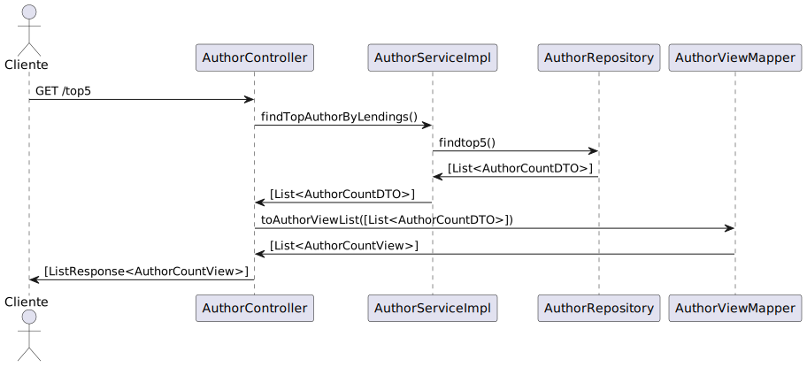
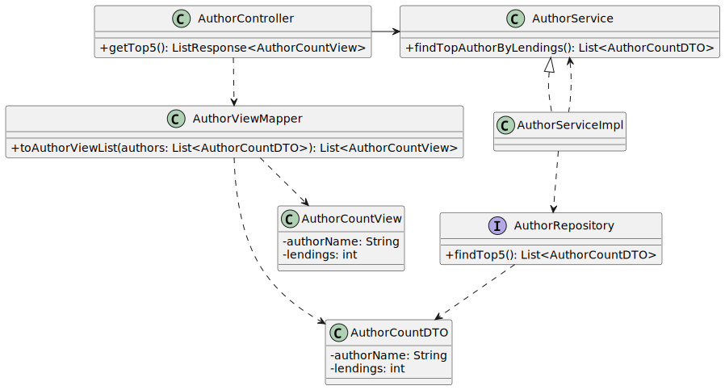

# WP #1B - Authors - As Reader I want to know the Top 5 authors which have the most lent books

## 1. Requirements Engineering
### 1.1. User Story Description

As Reader I want to know the Top 5 authors (which have the most lent books)
### 1.2. Customer Specifications and Clarifications

>[View WP1B](..%2FWP1B-Authors.md)

>[Q
O que é esperador retornar? Top 5 dos autores por ordem e ao lado o total de lendings de cada um deles?
](https://moodle.isep.ipp.pt/mod/forum/discuss.php?d=30001)
>
>A:  Sim

### 1.3. Acceptance Criteria
- Deve retornar os 5 autores com o maior numero de livros requisitados no ultimo ano

### 1.4. Found out Dependencies
- The reader must be authenticated in the system
- Lendings management
- Books repository
- Authors repository
### 1.5 Input and Output Data

**Input Data:**

* Typed data:
   - request to find out the top 5 authors whose books are most lending

**Output Data:**

* Top 5 authors 
* (In)success of the operation

## 2. Design
### 2.1. Sequence Diagram (SD)

### 2.2. Class Diagram (CD)

