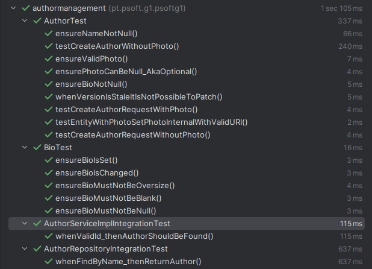

# WP1B Authors
## 1. Requirements Engineering
### 1.1. Customer Specifications and Clarifications

**From the [specifications document:](https://moodle.isep.ipp.pt/pluginfile.php/372607/mod_resource/content/0/PSOFT_LETI_assignment_2023-2024.pdf)**
>Central City library needs a system to manage their library, readers and book lending. The library consists
of thousands of books (no other media formats are available) organized by genre (e.g., Science-fiction,
mistery, Law, Medicine, etc.) that the readers can lend, take home and return after a period (typically 15
days). When a reader doesn’t return a book on time a fine will be applied per day of delay

**From the client clarifications:**

>[Q: Quais sao os critérios de aceitaçao do work package em questao para esta 2ª Fase?](https://moodle.isep.ipp.pt/mod/forum/discuss.php?d=29987)
>
>A: 
>3. As Librarian I want to register an author with an optional photo : os mesmos critérios do caso de uso do WP1 contemplando agora a possibilidade de adicionar uma imagem. 
>4. As Reader I want to know the books of an Author :
deve retornar a lista de livros desse autor ou uma lista vazia. devem ter em consideração paginação se a lista for demasiado longa
>5. As Reader I want to know the co-authors of an author and their respective books:
>deve retornar uma lista com os autores que escreveram livros em conjunto com um dado autor. para cada coautor deve ser retornada alista de livros escritos em conjunto. devem ter em consideração paginação se a lista for demasiado longa
>6. As Reader I want to know the Top 5 authors (which have the most lent books) :
>deve retornar os 5 autores com o maior numero de livros requisitados no ultimo ano

### 1.2. Found out Dependencies
- Books
- Lendings
- Authors

### 1.3. Acceptance Criteria
- As Librarian I want to register an author with an optional photo : os mesmos critérios do caso de uso do WP1 contemplando agora a possibilidade de adicionar uma imagem. 
- As Reader I want to know the books of an Author:
deve retornar a lista de livros desse autor ou uma lista vazia. devem ter em consideração paginação se a lista for demasiado longa
- As Reader I want to know the co-authors of an author and their respective books:
deve retornar uma lista com os autores que escreveram livros em conjunto com um dado autor. para cada coautor deve ser retornada alista de livros escritos em conjunto. devem ter em consideração paginação se a lista for demasiado longa
- As Reader I want to know the Top 5 authors (which have the most lent books) :
deve retornar os 5 autores com o maior numero de livros requisitados no ultimo ano

## 2. Design
### 2.1. Class Diagram (CD)

## 3. Tests
[Click here to go directly to the author's unit tests](..%2F..%2F..%2Fsrc%2Ftest%2Fjava%2Fpt%2Fpsoft%2Fg1%2Fpsoftg1%2Fauthormanagement)
- Results :

