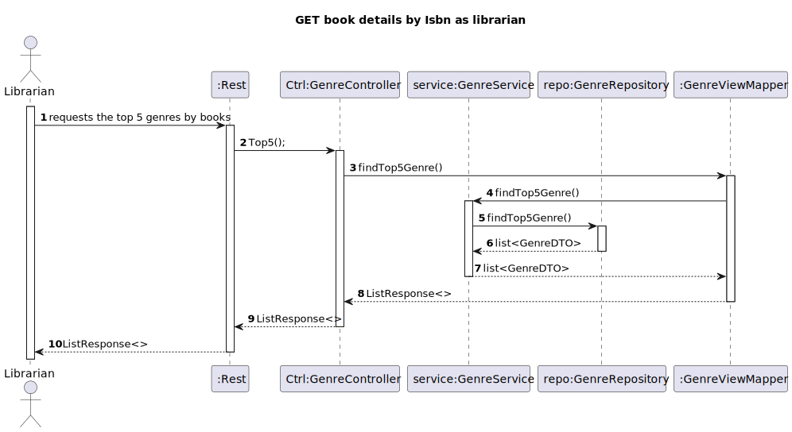

# WP #1B - Authors - As Reader I want to know the Top 5 authors which have the most lent books

## 1. Requirements Engineering
### 1.1. User Story Description

As Reader I want to know the Top 5 genre by books 
### 1.2. Customer Specifications and Clarifications

>>[View WP2B](../../../GlobalArtifacts/Aggregates/Book.md)

### 1.3. Acceptance Criteria
- AC

### 1.4. Found out Dependencies

- Books 
- Genres

### 1.5 Input and Output Data

**Input Data:**

* Typed data:
   - request to find out the top 5 genre with most books

**Output Data:**

* Top 5 genres 
* (In)success of the operation

## 3. Design
### 3.1. Sequence Diagram (SD)

### 3.2. Class Diagram (CD)

## 4. Tests
## 5. Observations
