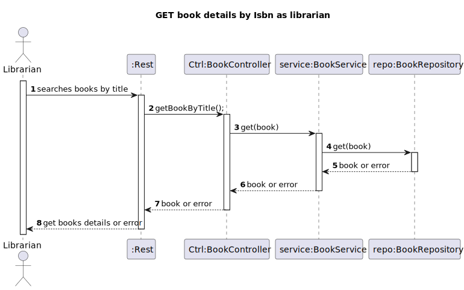
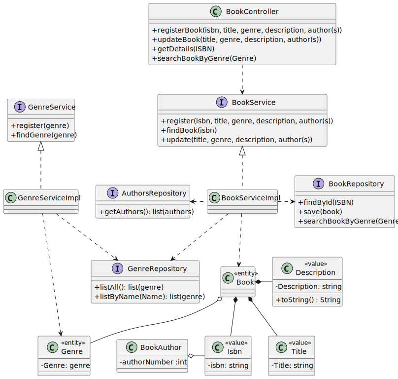

# WP#2A.9 Get the details of the Books
## 1. Requirements Engineering
### 1.1. User Story Description

As Librarian, I want to search a book given its title. 
### 1.2. Customer Specifications and Clarifications

[View WP2B](../../../GlobalArtifacts/Aggregates/Book.md)
)

### 1.3. Acceptance Criteria
- AC
-
### 1.4. Found out Dependencies
- The Libarian or Reader must be authenticated in the system
### 1.5 Input and Output Data
- The librarian or Reader needs to give the title of the book
  **Input Data:**
* Typed data:
    * Title

**Output Data:**

* (In)success of the operation

## 3. Design
### 3.1. Sequence Diagram (SD)

### 3.2. Class Diagram (CD)

## 4. Tests
## 5. Observations
