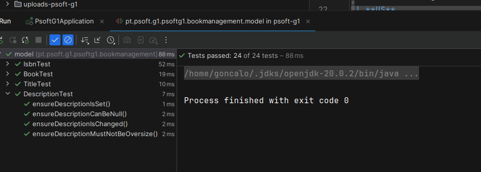

# WP2B Books
## 1. Requirements Engineering

### 1.1. Customer Specifications and Clarifications

**From the [specifications document:](https://moodle.isep.ipp.pt/pluginfile.php/372607/mod_resource/content/0/PSOFT_LETI_assignment_2023-2024.pdf)**
>Central City library needs a system to manage their library, readers and book lending. The library consists
of thousands of books (no other media formats are available) organized by genre (e.g., Science-fiction,
mistery, Law, Medicine, etc.) that the readers can lend, take home and return after a period (typically 15
days). When a reader doesn’t return a book on time a fine will be applied per day of delay

**From the client clarifications:**

>[Q: Quais são os critério de aceitação (acceptance criteria) da us07?](https://moodle.isep.ipp.pt/mod/forum/discuss.php?d=28891#p36487)
>
>A: Se tentar registar um livro com um ISBN já existente deve ser indicado um erro.
> Titulo do livro é obrigatório e não pode comecar ou terminar em espaços.
> Descrição é opcional e deve suportar conteudo HTML.
> Género e autor são obrigatórios.

>[Q: Qual o dado que precisamos de introduzir para proceder à atualização dos dados de um livro?](https://moodle.isep.ipp.pt/mod/forum/discuss.php?d=28929#p36537)
>
>A: À execção do ISBN todos os dados sao alteraveis

>[Q: um livro pode ter mais que um género?](https://moodle.isep.ipp.pt/mod/forum/discuss.php?d=29071#p36760)
>
>A: (Ricardo - respondido abaixo)

>[Q: Sobre a pergunta 3, creio que ainda não ficou claro se os 'genre's são escolhidos pelo 'librarian' (na hora de registar um livro) de uma lista existente (e eventualmente mutável), ou se são escritos manualmente pelo 'librarian'.](https://moodle.isep.ipp.pt/mod/forum/discuss.php?d=28911#p36699)
>
>A: Quando o Librarian regista um novo livro vai indicar **em que genéro** esse livro se classifica. só poderá indicar um dos géneros previamente registados no sistema

>[Q: Quais são as aceptance criteria das USs da WPA2B ? ][...]
>
>[Q: As Librarian, I want to register a book with a book cover photo] [...]
>
>A: this is a refinement of the existing use case. the user may choose to add a photo of the book cover. the photo must be in the jpeg or png format and at most 20 KB
>
> [Q: As Reader I want to search books by title] [...]
>
>A: The ability to search by title entering the first letters of the title
> [Q: As Librarian I want to know the Top 5 books lent] [...]
>
>A: returns the list of the 5 books that have been lent the most in the last year. it must return for each book, the number of times the book has been lent. the result must be sorted descending order.
>
> [Q: As Librarian I want to know the Top 5 genres] [...]
>
>A: returns the 5 genres that the librarian possesses more books of. it must return the number of books per genre. the result must be sorted descending order

### 1.2. Found out Dependencies

- Genre
- Lendings 

## 2. Design
### 2.1. Class Diagram (CD)

## 3. Tests 

