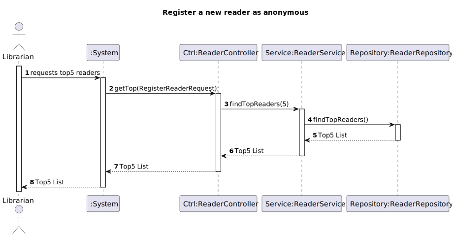

# WP#3B.11 Top5 Readers
## 1. Requirements Engineering
### 1.1. User Story Description

As Librarian I want to know the Top 5 readers

### 1.2. Customer Specifications and Clarifications

[View WP3B](../WP3B-Readers.md)

### 1.3. Acceptance Criteria
- Readers, in this list, must have lendings and the sorting should be made by the number of lendings in descending order

### 1.4. Found out Dependencies
- None
### 1.5 Input and Output Data

**Input Data:**
- None

**Output Data:**

* (In)success of the operation and list of top5
* 
## 2. Design
### 2.1. Sequence Diagram (SD)

### 2.2. Class Diagram (CD)

## 4. Tests
## 5. Observations
