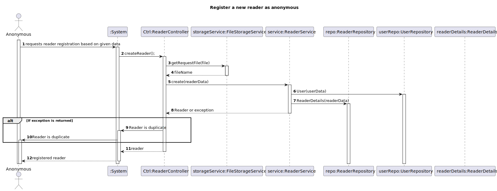
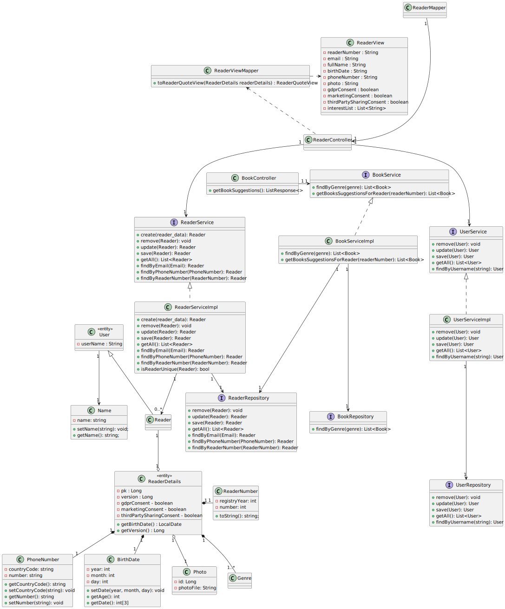

# WP#3B.12 Register Reader with optional Photo
## 1. Requirements Engineering
### 1.1. User Story Description

As anonymous I want to register as a reader with an optional photo, and optional list of interest
(i.e., the genre I’m interested in).

### 1.2. Customer Specifications and Clarifications

[View WPBA](../WP3B-Readers.md)

### 1.3. Acceptance Criteria
- Same acceptance criteria as WP#3A.11
- The photo is optional
- The list of interest is optional
- The photo must be of format JPEG, JPG or PNG and must not exceed 20KB

### 1.4 Input and Output Data

**Input Data:**
* Typed data:
    * Name
    * Email
    * Date of Birth
    * Phone Number
    * GDPR Consent
    * Username
    * Password
    * Photo (Optional)
    * List of Interests (Optional)

**Output Data:**

* (In)success of the operation

### 1.7. Functionality
### 1.8 Other Relevant Remarks
## 3. Design
### 3.1. Sequence Diagram (SD)

### 3.2. Class Diagram (CD)

## 4. Tests
## 5. Observations
