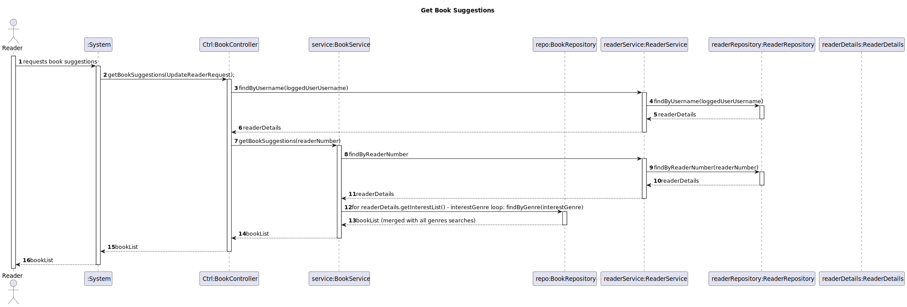

# WP#3B.13 Get Book Suggestions
## 1. Requirements Engineering
### 1.1. User Story Description

As Reader I want a list of book suggestions based on my interest list

### 1.2. Customer Specifications and Clarifications

[View WP3B](../WP3B-Readers.md)

### 1.3. Acceptance Criteria
- The list of interests must contain genres that exist on the system
- List of suggestions must have X amount of books configurable
- Book suggestion, per genre, is random

### 1.4 Input and Output Data

**Input Data:**

* Typed data:
    * None

**Output Data:**

* (In)success of the operation

### 1.7. Functionality
### 1.8 Other Relevant Remarks
## 3. Design
### 3.1. Sequence Diagram (SD)

### 3.2. Class Diagram (CD)

## 4. Tests
## 5. Observations
