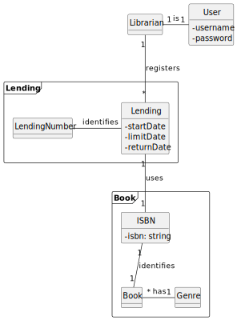
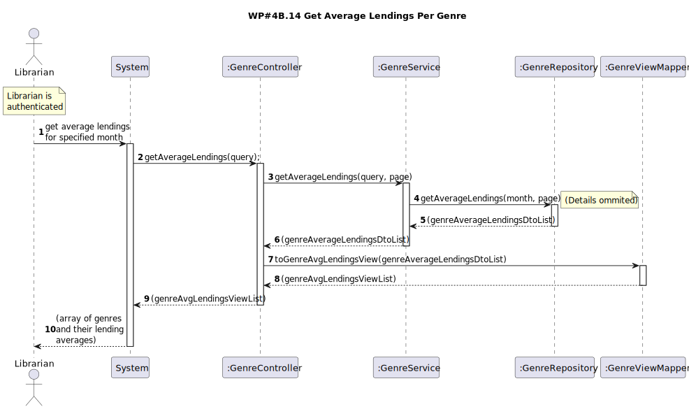
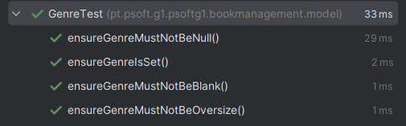

# WP#4A.14 Get Average Lendings On A Month
## 1. Requirements Engineering
### 1.1. User Story Description

As Librarian I want to know the average number of lending per genre of a certain month.

### 1.2. Customer Specifications and Clarifications

>[Q: Para esta US, também são incluídos tanto empréstimos em aberto como devolvidos? ](https://moodle.isep.ipp.pt/mod/forum/discuss.php?d=29835#p37841)
>
>A: todos os emprestimos independente do seu estado

>[Q: A média deve contemplar a parte decimal do valor? Se sim, com quantas casas decimais? ](https://moodle.isep.ipp.pt/mod/forum/discuss.php?d=29835#p37841)
>
>A: sim. 1 casa decimal

>[Q:  O que é que é realmente pretendido? A média diária de empréstimos por género num dado mês? Ou a média mensal de empréstimos por género num mês, ao longo de vários anos? ](https://moodle.isep.ipp.pt/mod/forum/discuss.php?d=29835#p37857)
>
>A: Pretende-se saber para esse mês, em média, quantos livros de um dado género foram emprestados por dia

### 1.3. Acceptance Criteria
- Pretende-se saber para esse mês, em média, quantos livros de um dado género foram emprestados por dia

### 1.4. Found out Dependencies
- A Librarian must be logged into the system.
- To get meaningfull data, at least one lending needs to be registered in the requested period.

### 1.5 Input and Output Data

**Input Data:**

* Typed data:
  * Year
  * Month
  * Page number
  * Page size

**Output Data:**

* Daily average of number of lendings over a certain month, per genre

## 2. OO Analysis
### 2.1. Relevant Domain Model Excerpt

## 3. Design
### 3.1. Sequence Diagram (SD)

### 3.2. Class Diagram (CD)

## 4. Tests
### 4.1. Unit Tests

## 5. Observations

