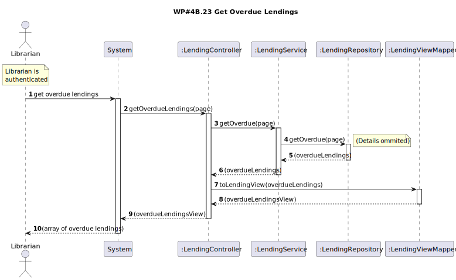
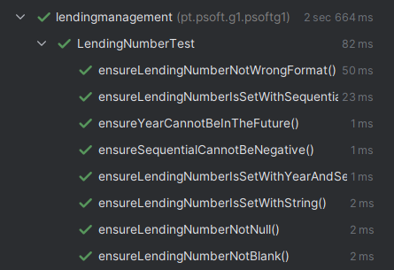
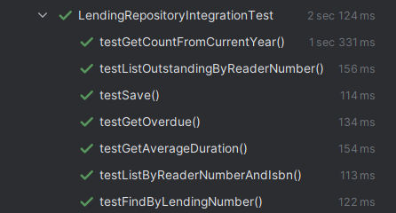
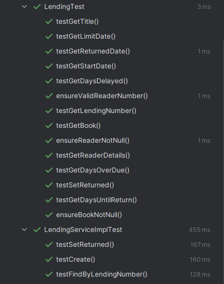

# WP#4A.15 Lend Book
## 1. Requirements Engineering
### 1.1. User Story Description

As Librarian I want to list overdue lending sorted by their tardiness.

### 1.2. Customer Specifications and Clarifications

>[Q: A listagem de empréstimos em atraso diz respeito a livros que se encontram emprestados, livros que já foram devolvidos ou ambos? ](https://moodle.isep.ipp.pt/mod/forum/discuss.php?d=29818#p37822)
>
>A: livros emprestados e que ainda nao foram devolvidos

>[Q: Qual é o número máximo de empréstimos que devem ser apresentados a cada consulta? ](https://moodle.isep.ipp.pt/mod/forum/discuss.php?d=29835#p37841)
>
>A: não há limite, mas devem suportar paginação no caso de operações com elevado número de resultados

### 1.3. Acceptance Criteria
- AC
- 
### 1.4. Found out Dependencies
### 1.5 Input and Output Data

**Input Data:**

* Typed data:
  * Page number
  * Max items per page

**Output Data:**
  * List of overdue lendings (not returned), sorted by tardiness.

## 2. OO Analysis
### 2.1. Relevant Domain Model Excerpt

### 2.2. Other Remarks
## 3. Design
### 3.1. Sequence Diagram (SD)

### 3.2. Class Diagram (CD)

## 4. Tests

## 5. Observations
