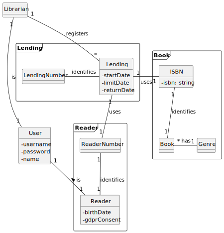
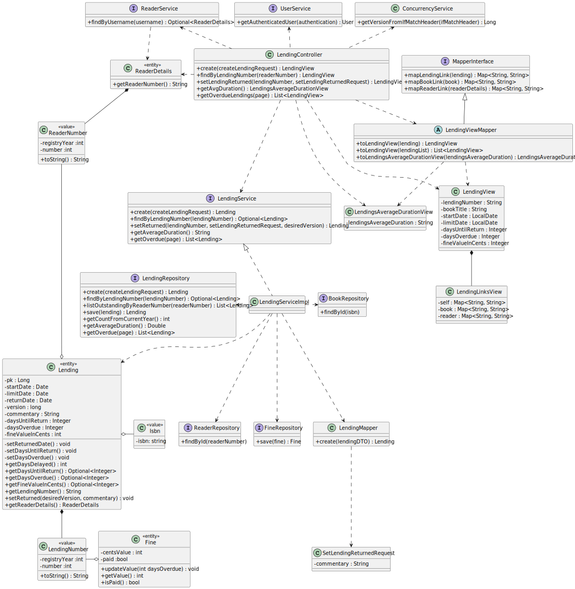

# WP4B Lendings
## 1. Requirements Engineering

### 1.2. Customer Specifications and Clarifications

**From the [specifications document:](https://moodle.isep.ipp.pt/pluginfile.php/372607/mod_resource/content/0/PSOFT_LETI_assignment_2023-2024.pdf)**
>Central City library needs a system to manage their library, readers and book lending. The library consists
of thousands of books (no other media formats are available) organized by genre (e.g., Science-fiction,
mistery, Law, Medicine, etc.) that the readers can lend, take home and return after a period (typically 15
days). When a reader doesn’t return a book on time a fine will be applied per day of delay

**From the client clarifications:**

## 2. OO Analysis
### 2.1. Relevant Domain Model Excerpt

## 3. Design
### 3.2. Class Diagram (CD)

