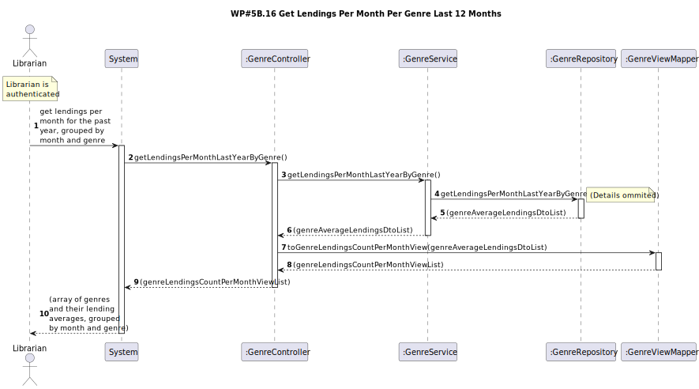

# WP#5.16 Get Lendings Per Month Per Genre Last 12 Months
## 1. Requirements Engineering
### 1.1. User Story Description

As Librarian I want to know the number of lendings per month for the last 12 months, broken
down by genre

### 1.2. Customer Specifications and Clarifications

### 1.3. Acceptance Criteria
- Lista ordenada por mês e por género com o número total de empréstimos desse género nesse mês

### 1.4. Found out Dependencies
### 1.5 Input and Output Data

**Input Data:**

* Typed data:
  * N/A

**Output Data:**

* (In)success of the operation

## 2. OO Analysis
### 2.1. Relevant Domain Model Excerpt

## 3. Design
### 3.1. Sequence Diagram (SD)

### 3.2. Class Diagram (CD)

## 4. Tests
## 5. Observations
