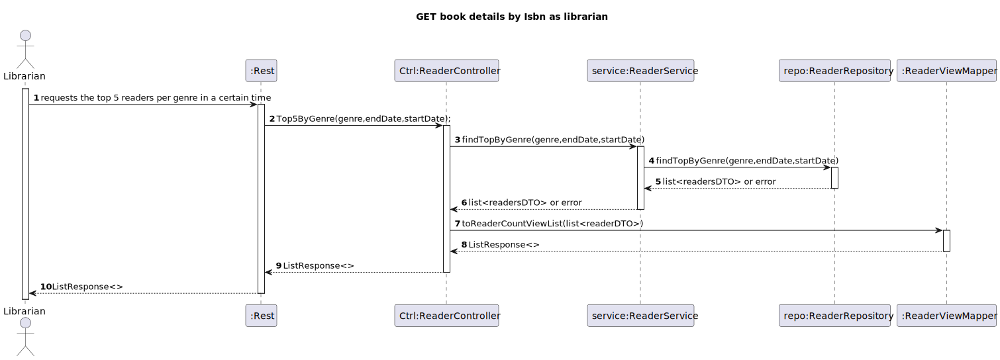

# WP#5.18 Get Monthly Lending Per Reader
## 1. Requirements Engineering
### 1.1. User Story Description

As Librarian I want to know the Top 5 readers per genre of a certain period

### 1.2. Customer Specifications and Clarifications

### 1.3. Acceptance Criteria
- AC
- 
### 1.4. Found out Dependencies
### 1.5 Input and Output Data

**Input Data:**

* Typed data:
  * Genre
  * Start Date
  * End Date

**Output Data:**

* (In)success of the operation

## 2. Design
### 2.1. Sequence Diagram (SD)

[//]: # ()

## 4. Tests
## 5. Observations
