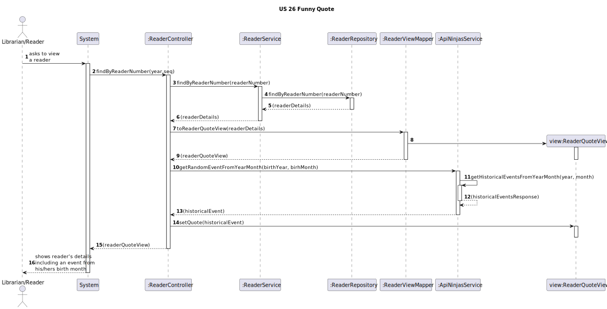
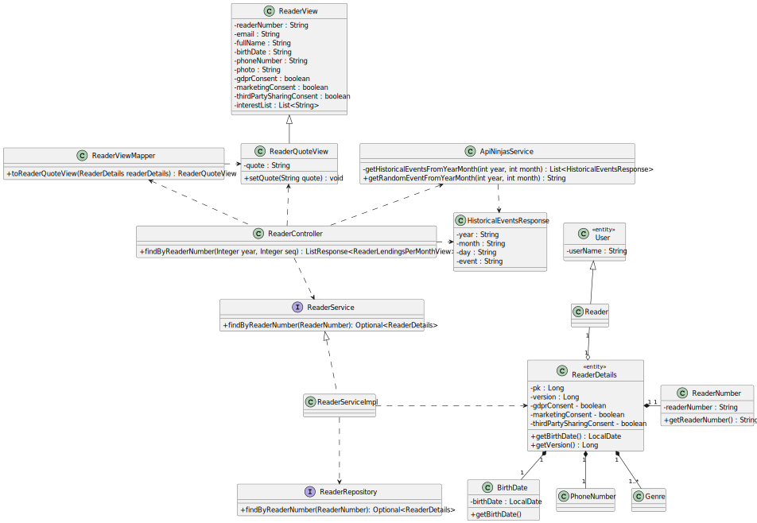

# US-26-FunnyQuote
## 1. Requirements Engineering
### 1.1. User Story Description

Augment the reader profile with a funny quote based on the date of birth of the reader

### 1.2. Customer Specifications and Clarifications

>[Q: Quais são os critérios de aceitação desta US? ](https://moodle.isep.ipp.pt/mod/forum/discuss.php?d=29912#p37938)
>
>A: ao retornar os dados do leitor incluir um novo atributo que contém uma citação/facto interessante que tenha acontecido no dia de aniversário do leitor (considerar ano/mês)

>[Q: Relativamente à funcionalidade das funny quotes de acordo com o mes ou ano de nascimento do reader, é necessario ser ilustrada as informação de todos os readers e adicionalmente a funnyquote de cada reader ou so quer esta funcionalidade relativamente a um specific reader à parte?  ](https://moodle.isep.ipp.pt/mod/forum/discuss.php?d=30080#p38194)
>
>A: Apenas de um dado reader quando se obter o perfil do mesmo

### 1.3. Acceptance Criteria
- ao retornar os dados do leitor incluir um novo atributo que contém uma citação/facto interessante que tenha acontecido no dia de aniversário do leitor (considerar ano/mês)

### 1.4. Found out Dependencies
- The requested reader needs to be registered in the system
- The user needs to be authenticated and with permissions to access the reader's profile

### 1.5 Input and Output Data

**Input Data:**
* Typed data:
  * Reader Number

**Output Data:**
  * Reader's details, including a message relative to his/hers birthdate.

## 3. Design
### 3.1. Sequence Diagram (SD)

### 3.2. Class Diagram (CD)

## 4. Tests
## 5. Observations
Since we were unable to find an API that provided funny quotes based on a date, we opted for an api that retrieved news/events based on a date.
