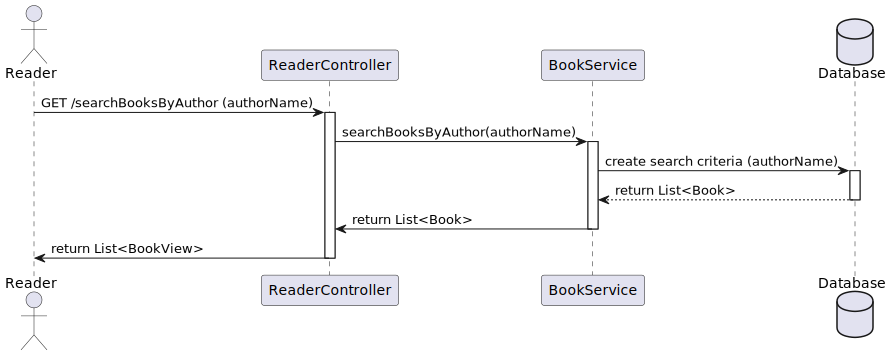
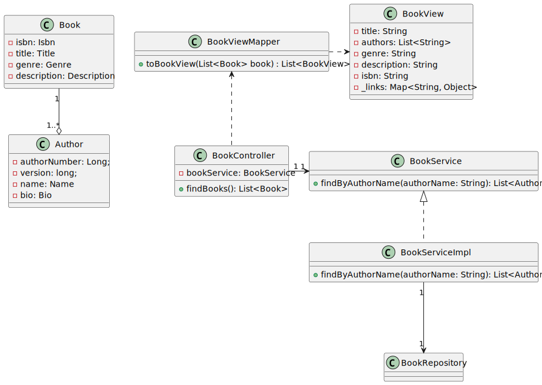

# WP#5.27 - Search books by author
## 1. Requirements Engineering
### 1.1. User Story Description

As Reader I want to search books by author

### 1.2. Customer Specifications and Clarifications

>[Q: Quais são os critérios de aceitação destas USs?](https://moodle.isep.ipp.pt/mod/forum/discuss.php?d=29912)
>
>A: Pesquisa de livros pelo autor cujo nome comece pelo valor introduzido pelo utilizador

### 1.3. Acceptance Criteria
- Pesquisa de livros pelo autor cujo nome comece pelo valor introduzido pelo utilizador 

### 1.4. Found out Dependencies
- The reader must be authenticated in the system
- Books repository
- Authors repository
### 1.5 Input and Output Data
**Input Data:**

* Typed data:
  * Name of an Author

**Output Data:**
* Books of an Author
* (In)success of the operation

## 2. Design
### 2.1. Sequence Diagram (SD)

### 2.2. Class Diagram (CD)

