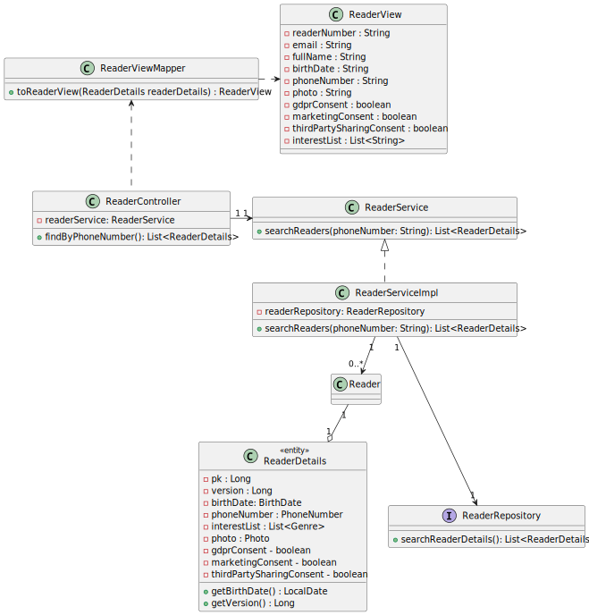

# WP#5.29 - Search Readers by email
## 1. Requirements Engineering
### 1.1. User Story Description

As Librarian I want to search Readers by email

### 1.2. Customer Specifications and Clarifications

>[Q: Quais são os critérios de aceitação destas USs?](https://moodle.isep.ipp.pt/mod/forum/discuss.php?d=29912)
>
>A: Pesquisa de leitores pelo email. Pesquisa exata.

### 1.3. Acceptance Criteria
-  Pesquisa de leitores pelo email. Pesquisa exata.
### 1.4. Found out Dependencies
- The librarian must be authenticated in the system
- Reader repository
### 1.5 Input and Output Data
**Input Data:**

* Typed data:
  * Email

**Output Data:**
* Reader that matches that email
* (In)success of the operation

## 2. Design
### 2.1. Sequence Diagram (SD)

### 2.2. Class Diagram (CD)

