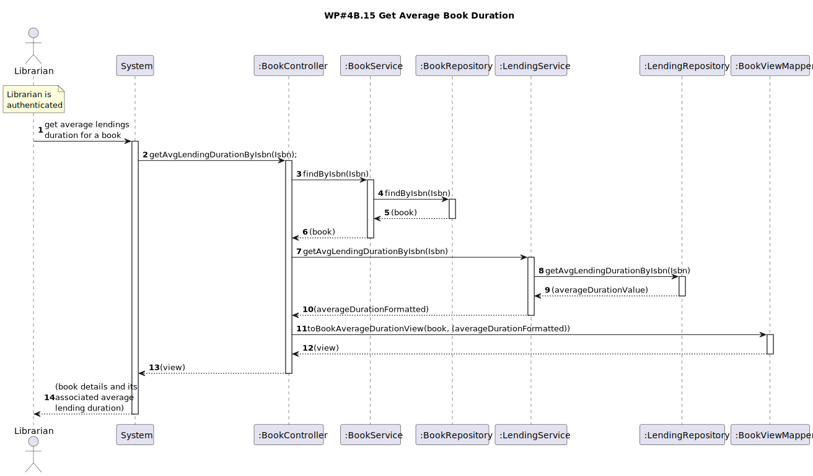

# Bonus Use Cases - US30 Get Average Lending Duration Per Book
## 1. Requirements Engineering
### 1.1. User Story Description

As Librarian I want to know the average lending duration per book

### 1.2. Customer Specifications and Clarifications

### 1.3. Acceptance Criteria
- para um dado livro, retornar a duração média dos seus empréstimos no último ano

### 1.4. Found out Dependencies
- A Librarian must be logged into the system.
- To get meaningfull data, at least one lending needs to be registered with the requested book.

### 1.5 Input and Output Data

**Input Data:**

* Typed data:
  * ISBN

**Output Data:**
  * Book details and the average lending duration

### 1.6. System Sequence Diagram (SSD)
### 1.7. Functionality
### 1.8 Other Relevant Remarks
## 2. OO Analysis
### 2.1. Relevant Domain Model Excerpt

### 2.2. Other Remarks
## 3. Design
### 3.1. Sequence Diagram (SD)

### 3.2. Class Diagram (CD)

## 4. Tests
## 5. Observations
